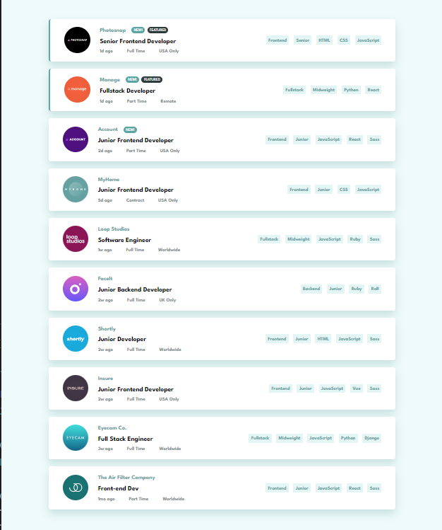

### The challenge

Users should be able to:

- [x] View the optimal layout for the site depending on their device's screen size
- [x] See hover states for all interactive elements on the page
- [x] Filter job listings based on the categories

### Links

- Solution URL: [Solution](https://www.frontendmentor.io/solutions/job-listing-javascript-CiWNoNL5Mj)
- Live Site URL: [LIVE](https://staticjoblist.netlify.app/)

### Built with

- HTML5 
- SCSS 
- JAVASCRIPT

### Continued development

Optimize the javascript code 

## Author

- Frontend Mentor - [Abrosss](https://www.frontendmentor.io/profile/Abrosss)
- [Twitter](https://twitter.com/ronessu)

